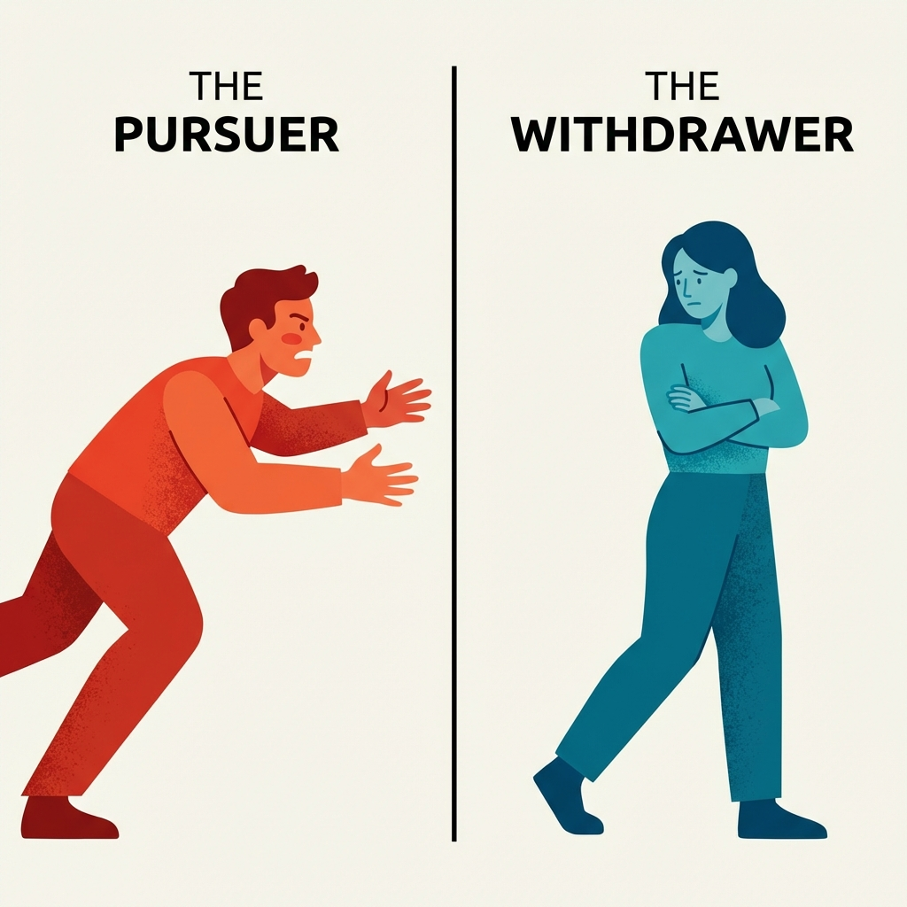
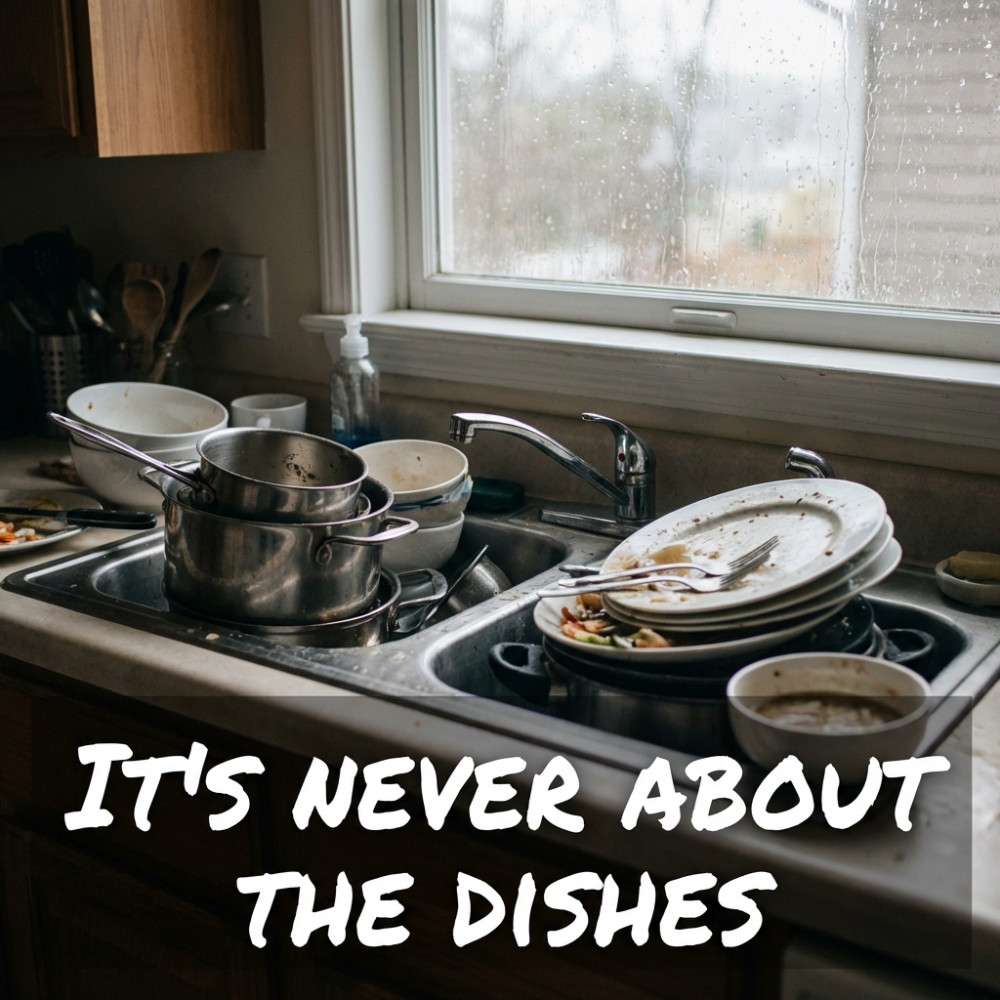

# Meta Ads Strategy - Zero Friction Funnel ($19)

**Goal:** Stop the scroll, trigger "that's me!", and force the click to `/test`.
**Funnel:** Ad -> `/test` (Quiz) -> Teaser ($19) -> Checkout.

---

## 🏗️ Ad Angles Overview

| Angle | Psychological Trigger | Target Audience |
| :--- | :--- | :--- |
| **A. Silent Divorce** | Fear / Urgency | Couples 30+, Parents, "Roommates" phase |
| **B. The Validation** | Authority / Relief | Women 25-45, Psychology lovers |
| **C. The Quiz** | Curiosity / Identity | Broad / Cold Traffic |
| **D. Micro-Trigger** | Relatability | People tired of "stupid" fights (User Aware) |
| **E. The Translator** | Solution / Hope | People feeling "Unheard" (Problem Aware) |
| **F. Biological Alibi** | Guilt Removal | High-conflict couples (Solution Unaware) |

---

## 📝 Detailed Creatives

### Angle A: The "Silent Divorce" (Fear/Urgency)
*   **Visual**: A photo of a couple in bed, back-to-back, awake, miserable. Blue/Cold tones.
*   **Headline**: "Why you feel lonely even when they are right next to you."
*   **Primary Text**:
    > You’re not fighting anymore. That’s the problem. ❄️
    >
    > Silence isn't peace. It’s the sound of your bond slowly breaking. Psychologists call this the **"Disconnection Loop"**, and it is the #1 predictor of divorce.
    >
    > It’s not that you don't love each other. It’s that your nervous systems are speaking different languages.
    >
    > Take the 2-minute test to translate your partner's silence before it becomes permanent.
*   **CTA Button**: [Check Your Pattern]
*   **Destination**: `/test`

### Angle B: The "Validation" (Authority/Science)
*   **Visual**: A simple minimalist chart showing "What you say" (Green Circle) vs "What they hear" (Red Spiky Shape).
*   **Headline**: "You are NOT crazy. You are just misunderstood."
*   **Primary Text**:
    > Ever feel like you’re screaming in a glass box? 🗣️🔇
    >
    > You ask for connection ("Can we talk?"), but they hear an attack ("You're failing me").
    >
    > This isn't a personality flaw. It's a biological mismatch in how you both process stress.
    >
    > We analyzed 10,000+ interactions to decode *exactly* why your partner shuts down or explodes.
    >
    > Find out your Relationship Type in 12 questions.
*   **CTA Button**: [Decode My Relationship]
*   **Destination**: `/test`

### Angle C: The "Interactive Quiz" (Curiosity)
*   **Visual**: 
    Split screen. Left side: Person chasing (Red text: "The Pursuer"). Right Side: Person walking away (Blue text: "The Withdrawer").
*   **Headline**: "Are you the 'Chaser' or the 'Runner'?"
*   **Primary Text**:
    > Every couple has a dynamic. 80% of couples are stuck in the "Anxious-Avoidant" trap without knowing it. 🪤
    >
    > Which one are you?
    > 🔴 **The Chaser:** "I need to talk to resolve things NOW."
    > 🔵 **The Container:** "I need space to think before I speak."
    >
    > If you are 🔴 and they are 🔵, your biological instincts are at war.
    >
    > See your compatibility score instantly. 👇
*   **CTA Button**: [Start Free Test]
*   **Destination**: `/test`

### Angle D: The "Micro-Trigger" (Relatability)
*   **Visual**: 
    A high-res but candid picture of a sink full of dishes or a pile of laundry. Text overlay in "Meme" font or bold sans-serif: "It's never about the dishes."
*   **Headline**: "Why you really fight about the laundry (Science Explained)."
*   **Primary Text**:
    > You think you're fighting about chores? You're not. 🍽️
    >
    > You are fighting about **"Recognition"** vs **"Autonomy"**.
    >
    > When you see the mess, your brain screams "I don't matter!".
    > When they hear the complaint, their brain screams "I'm being controlled!".
    >
    > Stop treating the symptom. Treat the root cause.
    >
    > See your subconscious triggers in 2 minutes.
*   **CTA Button**: [Find The Root Cause]
*   **Destination**: `/test`

### Angle E: The "Translator" (Solution Aware)
*   **Visual**: Illustration. Two people facing each other. One has a speech bubble in "French", the other in "Japanese". Or a "Google Translate" UI metaphor translating "Fine" to "I'm actually hurt".
*   **Headline**: "You are speaking 'Safety'. They are hearing 'Attack'."
*   **Primary Text**:
    > The #1 reason couples split isn't lack of love. It's **Misinterpretation**. 📖
    >
    > You say: "We need to talk." (Seeking Connection)
    > They hear: "You are in trouble." (Threat Detection)
    >
    > Result? They shut down. You spiral.
    >
    > Stop guessing. Get the "Translation Manual" for your specific relationship dynamic.
*   **CTA Button**: [Get My Manual]
*   **Destination**: `/test`

### Angle F: The "Biological Alibi" (Guilt Removal)
*   **Visual**: 
    An MRI scan of a brain or a nervous system diagram (simplified, scientific look). Text: "It's not your personality. It's your Amygdala."
*   **Headline**: "Stop blaming yourself for 'overreacting'."
*   **Primary Text**:
    > Stop blaming yourself for "being too much".
    > Stop blaming them for "not caring".
    >
    > During conflict, your logical brain shuts off. You enter "Survival Mode". 🧠
    >
    > We analyzed your nervous system's default setting:
    > - Do you **Fight** (Pursue)?
    > - Or **Flight** (Withdraw)?
    >
    > Understanding this biological switch changes everything instantly.
*   **CTA Button**: [Analyze My Nervous System]
*   **Destination**: `/test`
